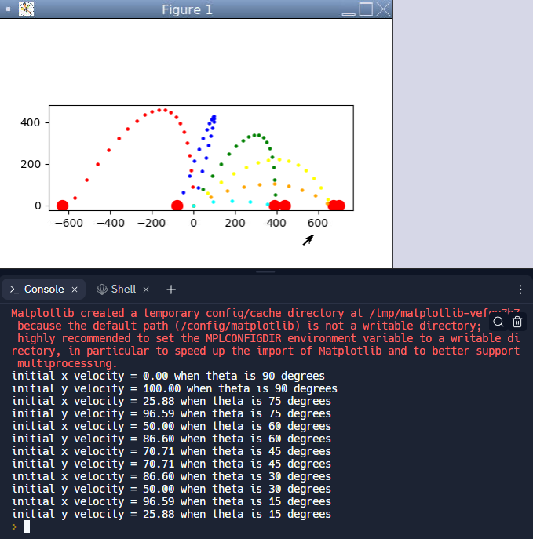
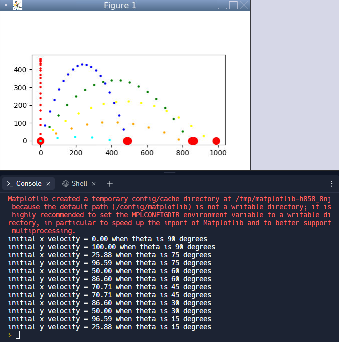
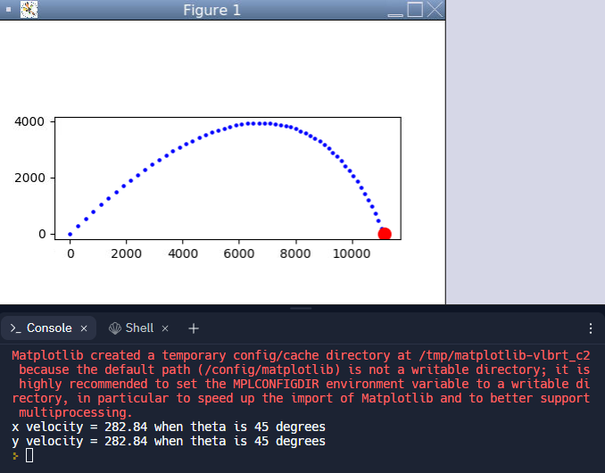
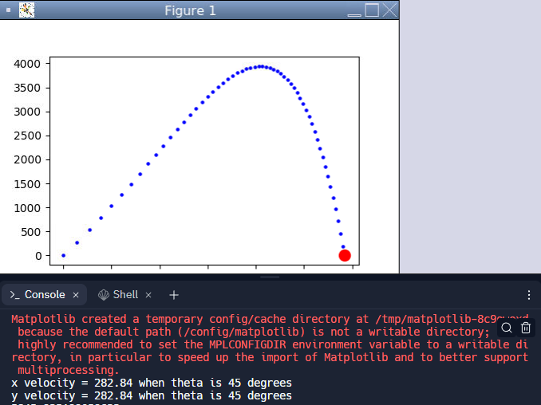
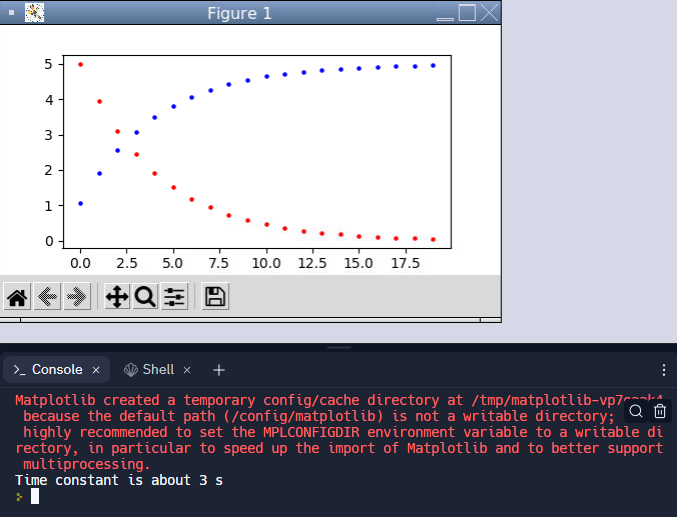
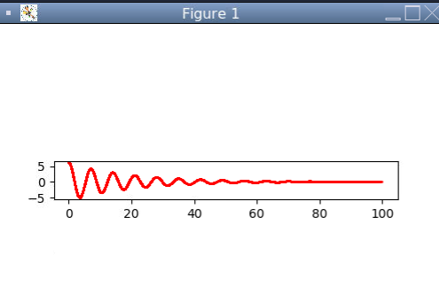

# Engineering_Applications_Prog
Various codes I've written to model solutions to engineering application problems through objective programming during my Sophomore and Junior year courses.

Some highlights of the models and simulations are shown below:

*Ballistics Missles Trajectory Modeling with Air Drag*

*Ballistics Misseles Trajectory Modeling without Air Drag*

*Ballistics Optimized Modeling with Air Drag*

*Capacitor Harmonics*

*Oscillator Model*

